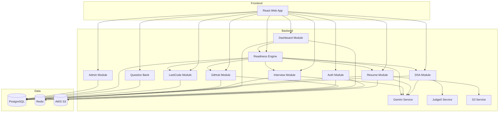

# High-Level Design (HLD)

## InterviewGPT — Component & Data Flow

**Version:** 1.0.0

---

## 1. System Component Map

```
┌────────────────────────────────────────────────────────────────────────────┐
│                           FRONTEND (apps/web)                               │
├────────────────────────────────────────────────────────────────────────────┤
│  Pages          │  Features              │  Shared                          │
│  ─────────      │  ────────              │  ──────                          │
│  Landing        │  auth/                 │  components/ui (Shadcn)          │
│  Login/Register │  dashboard/            │  components/layout               │
│  Dashboard      │  dsa/                  │  hooks/                          │
│  DSA Arena      │  resume/               │  lib/api-client                  │
│  Resume         │  interview/            │  lib/utils                       │
│  Mock Interview │  github/               │  stores/ (Zustand)               │
│  GitHub         │  leetcode/             │  types/ (from @interviewgpt/shared)│
│  LeetCode       │  company-bank/         │                                  │
│  Company Bank   │  readiness/            │                                  │
│  Admin          │  admin/                │                                  │
└────────────────────────────────────────────────────────────────────────────┘
                                      │
                              REST /api/v1
                                      │
┌────────────────────────────────────────────────────────────────────────────┐
│                           BACKEND (apps/api)                                │
├────────────────────────────────────────────────────────────────────────────┤
│  Routes (/api/v1)                                                           │
│  ├── /auth          → AuthController                                        │
│  ├── /users         → UserController                                        │
│  ├── /dashboard     → DashboardController                                   │
│  ├── /dsa           → DsaController                                         │
│  ├── /resume        → ResumeController                                      │
│  ├── /interviews    → InterviewController                                   │
│  ├── /github        → GitHubController                                      │
│  ├── /leetcode      → LeetCodeController                                    │
│  ├── /questions     → QuestionBankController                                │
│  ├── /readiness     → ReadinessController                                   │
│  └── /admin         → AdminController                                       │
│                                                                             │
│  Services Layer                                                             │
│  ├── AuthService, TokenService, EmailService                                │
│  ├── DsaService, Judge0Service                                              │
│  ├── ResumeService, S3Service, PdfParserService                             │
│  ├── InterviewService, GeminiService                                        │
│  ├── GitHubService, LeetCodeService                                         │
│  ├── ReadinessService, DashboardService                                     │
│  └── AdminService, AnalyticsService                                         │
│                                                                             │
│  Infrastructure                                                             │
│  ├── prisma/ (PrismaClient)                                                 │
│  ├── redis/ (RedisClient)                                                   │
│  ├── middleware/ (auth, validate, error, rateLimit)                         │
│  └── config/ (env validation)                                               │
└────────────────────────────────────────────────────────────────────────────┘
                                      │
┌────────────────────────────────────────────────────────────────────────────┐
│                      SHARED (packages/shared)                               │
│  Zod schemas │ TypeScript types │ Constants │ Enums │ Utils               │
└────────────────────────────────────────────────────────────────────────────┘
```

---

## 2. Request Lifecycle

```
Browser                API Server              Services              Data Stores
   │                       │                       │                      │
   │── POST /auth/login ──►│                       │                      │
   │                       │── validate (Zod) ────►│                      │
   │                       │                       │── findUser ─────────►│ PostgreSQL
   │                       │                       │◄── user ─────────────│
   │                       │                       │── bcrypt compare     │
   │                       │                       │── generate JWT       │
   │                       │                       │── store refresh ────►│ Redis
   │◄── 200 { tokens } ────│◄──────────────────────│                      │
   │                       │                       │                      │
   │── GET /dashboard ────►│                       │                      │
   │   Authorization:      │── auth middleware ───►│                      │
   │   Bearer <token>      │                       │── getMetrics ───────►│ PostgreSQL + Redis
   │◄── 200 { metrics } ───│◄──────────────────────│                      │
```

---

## 3. Module Interaction Diagram



---

## 4. Authentication Flow

### 4.1 Email/Password Login

```
User → Login Form → POST /api/v1/auth/login
                         │
                         ├─ Validate credentials
                         ├─ Issue accessToken (15m) + refreshToken (7d)
                         ├─ Store refreshToken hash in DB
                         └─ Return tokens + user profile

Subsequent requests → Authorization: Bearer <accessToken>
Token expired → POST /api/v1/auth/refresh { refreshToken }
```

### 4.2 Google OAuth

```
User → Click "Sign in with Google"
     → Redirect to Google consent
     → Callback /api/v1/auth/google/callback?code=...
     → Exchange code for Google profile
     → Find or create User (provider: GOOGLE)
     → Issue JWT tokens
     → Redirect to frontend /auth/callback?tokens=... (or httpOnly cookie)
```

---

## 5. DSA Submission Flow

```
1. User writes code in Monaco editor
2. POST /api/v1/dsa/problems/:id/submit { language, sourceCode }
3. DsaService creates Submission (status: PENDING)
4. Judge0Service submits to Judge0 with test cases
5. Poll/wait for results (sync MVP; async queue Phase 5+)
6. Compare outputs against expected (visible + hidden)
7. Update Submission status: ACCEPTED | WRONG_ANSWER | TLE | ...
8. If ACCEPTED → update UserProblemProgress
9. Invalidate dashboard + readiness caches
10. Return verdict to frontend
```

---

## 6. Resume Analysis Flow

```
1. User uploads PDF via presigned S3 URL or multipart upload
2. POST /api/v1/resume/analyze { s3Key, targetRole }
3. PdfParserService extracts text
4. ResumeService computes ATS score (rule-based + keyword match)
5. GeminiService generates suggestions
6. Store ResumeAnalysis record
7. Update user resumeScore metric
8. Trigger readiness recalculation
9. Return analysis result to frontend
```

---

## 7. Mock Interview Flow

```
1. POST /api/v1/interviews/sessions { type, role, company }
2. Create InterviewSession (status: IN_PROGRESS)
3. GeminiService generates first question (system prompt with context)
4. Loop:
   a. Display question to user
   b. POST /api/v1/interviews/sessions/:id/answer { answer }
   c. Gemini evaluates → store InterviewQA + feedback
   d. Generate next question OR end session (max 8 questions)
5. POST /api/v1/interviews/sessions/:id/complete
6. Gemini generates session summary
7. Update interviewScore metric
8. Trigger readiness recalculation
```

---

## 8. Dashboard Aggregation

Single endpoint reduces waterfall requests:

```
GET /api/v1/dashboard

Response aggregates:
├── user profile snippet
├── metrics {
│     problemsSolved, resumeScore, interviewScore,
│     githubScore, placementReadiness
│   }
├── charts {
│     weeklyActivity[], topicProgress[]
│   }
└── recentActivity[] (last 10 events)

Cache: Redis key `dashboard:{userId}` TTL 5 min
Invalidate on: submission, analysis, interview complete, github sync
```

---

## 9. Frontend Routing Structure

| Route | Access | Component |
|-------|--------|-----------|
| `/` | Public | LandingPage |
| `/login` | Public | LoginPage |
| `/register` | Public | RegisterPage |
| `/forgot-password` | Public | ForgotPasswordPage |
| `/reset-password` | Public | ResetPasswordPage |
| `/auth/callback` | Public | OAuthCallbackPage |
| `/dashboard` | Protected | DashboardPage |
| `/dsa` | Protected | ProblemListPage |
| `/dsa/:slug` | Protected | ProblemDetailPage |
| `/resume` | Protected | ResumeAnalyzerPage |
| `/interview` | Protected | MockInterviewPage |
| `/interview/:sessionId` | Protected | InterviewSessionPage |
| `/github` | Protected | GitHubAnalyzerPage |
| `/leetcode` | Protected | LeetCodeTrackerPage |
| `/questions` | Protected | CompanyBankPage |
| `/readiness` | Protected | ReadinessPage |
| `/admin/*` | Admin | AdminLayout + sub-routes |
| `/settings/profile` | Protected | ProfileSettingsPage |

---

## 10. Error Handling Strategy

| Layer | Strategy |
|-------|----------|
| Validation | Zod → 400 with field errors |
| Auth | 401 Unauthorized |
| Authorization | 403 Forbidden |
| Not Found | 404 with resource name |
| Conflict | 409 (duplicate email, etc.) |
| Rate Limit | 429 with Retry-After |
| External API | 502 with safe message; log details |
| Unknown | 500; never expose stack in prod |

Standard error response:

```json
{
  "success": false,
  "error": {
    "code": "VALIDATION_ERROR",
    "message": "Invalid input",
    "details": [{ "field": "email", "message": "Invalid email format" }]
  }
}
```
