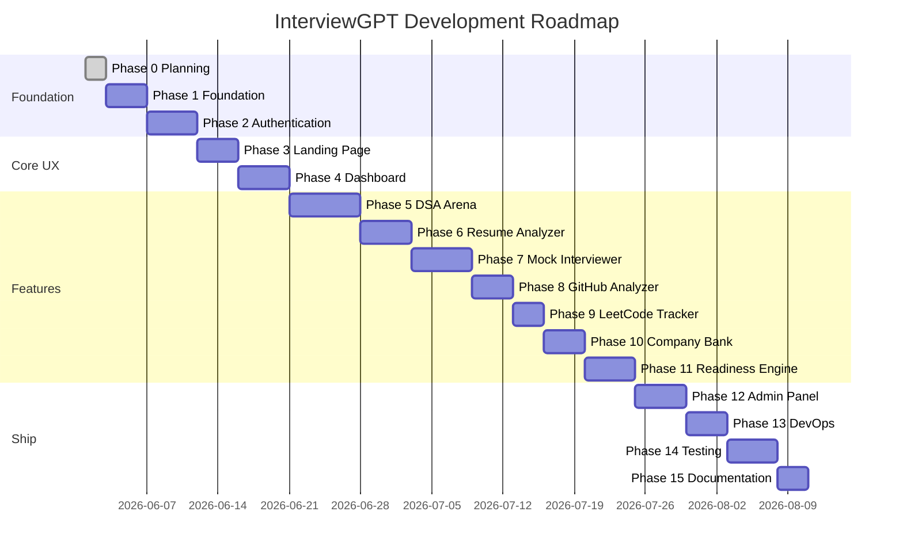

# Development Roadmap

## InterviewGPT — Phase-by-Phase Timeline

**Version:** 1.0.0  
**Estimated Total Duration:** 10–14 weeks (solo developer, part-time)

---

## Roadmap Overview

---

## Phase Details

### Phase 0 — Architecture & Planning ✅
**Duration:** 2 days  
**Status:** Complete

| Deliverable | Status |
|-------------|--------|
| PRD | ✅ |
| User Personas | ✅ |
| Functional Requirements | ✅ |
| Non-Functional Requirements | ✅ |
| System Architecture | ✅ |
| HLD / LLD | ✅ |
| Database Schema | ✅ |
| ER Diagram | ✅ |
| API Design | ✅ |
| Folder Structure | ✅ |
| Development Roadmap | ✅ |

**Exit Criteria:** Stakeholder approval to proceed

---

### Phase 1 — Project Foundation
**Duration:** 3–4 days  
**Dependencies:** Phase 0 approval

| Task | Output |
|------|--------|
| Initialize npm monorepo | Root package.json, workspaces |
| Setup `apps/api` | Express + TS + nodemon |
| Setup `apps/web` | Vite + React + TS |
| Configure Tailwind + Shadcn | components.json, base UI |
| Prisma + PostgreSQL | schema (auth tables), migrate |
| Redis connection | ioredis client |
| Shared package | Base Zod schemas, types |
| Docker Compose | postgres, redis, api, web |
| Environment config | .env.example, env validation |
| ESLint + Prettier | Shared config |

**Exit Criteria:** `docker-compose up` runs both apps; health check passes

---

### Phase 2 — Authentication System
**Duration:** 4–5 days  
**Dependencies:** Phase 1

| Task | Output |
|------|--------|
| User registration API | POST /auth/register |
| Login / logout / refresh | JWT flow |
| Forgot / reset password | Email service (console dev) |
| Google OAuth | Passport or manual OAuth flow |
| Auth middleware + role guard | authenticate, requireRole |
| Frontend auth pages | Login, Register, Forgot, Reset |
| Protected routes | ProtectedRoute component |
| Token storage + refresh | api-client interceptor |

**Exit Criteria:** Full auth flow works; role-based route protection verified

---

### Phase 3 — Landing Page
**Duration:** 3–4 days  
**Dependencies:** Phase 2

| Task | Output |
|------|--------|
| Hero section | Gradient, CTA, animation |
| Features grid | 5 module cards |
| Testimonials | Carousel |
| Pricing | 3-tier display |
| FAQ | Accordion |
| Footer | Links, branding |
| Responsive + animations | Framer Motion |

**Exit Criteria:** Public landing page live; Lighthouse > 85 performance

---

### Phase 4 — Dashboard
**Duration:** 4–5 days  
**Dependencies:** Phase 3

| Task | Output |
|------|--------|
| App layout | Sidebar + Navbar |
| Dashboard API | GET /dashboard |
| Metrics cards | 5 KPI cards |
| Charts | Recharts activity + topics |
| Activity feed | Recent events |
| Profile section | Avatar, name, quick settings |

**Exit Criteria:** Authenticated user sees dashboard with real/cached metrics

---

### Phase 5 — DSA Coding Arena
**Duration:** 6–7 days  
**Dependencies:** Phase 4

| Task | Output |
|------|--------|
| DSA schema migration | Problems, test cases, submissions |
| Problem CRUD (seed) | 20 seed problems |
| Problem list + filters | Frontend list page |
| Monaco code editor | Multi-language support |
| Judge0 integration | Submit + verdict |
| Submission history | Per-problem history |
| AI hints | Gemini integration |

**Exit Criteria:** User can solve a problem end-to-end with hidden test validation

---

### Phase 6 — Resume Analyzer
**Duration:** 4–5 days  
**Dependencies:** Phase 4

| Task | Output |
|------|--------|
| S3 upload flow | Presigned URLs |
| PDF parsing | pdf-parse or similar |
| ATS scoring | Rule-based engine |
| AI suggestions | Gemini |
| Analysis history | List + latest metric |

**Exit Criteria:** PDF upload → score + suggestions in < 30s

---

### Phase 7 — AI Mock Interviewer
**Duration:** 5–6 days  
**Dependencies:** Phase 4

| Task | Output |
|------|--------|
| Session schema | InterviewSession, InterviewQA |
| Session lifecycle API | Create, answer, complete |
| Gemini prompts | Type/company/role context |
| Interview UI | Chat-style interface |
| Session summary | Score + feedback |

**Exit Criteria:** Complete 5-question technical mock interview with summary

---

### Phase 8 — GitHub Analyzer
**Duration:** 3–4 days  
**Dependencies:** Phase 4

| Task | Output |
|------|--------|
| GitHub OAuth | Connect account |
| GitHub API fetch | Repos, commits, contributions |
| Scoring algorithm | Weighted GitHub score |
| Analytics UI | Charts + repo breakdown |
| Redis caching | 1-hour TTL |

**Exit Criteria:** GitHub profile analyzed with score and visuals

---

### Phase 9 — LeetCode Tracker
**Duration:** 2–3 days  
**Dependencies:** Phase 4

| Task | Output |
|------|--------|
| LeetCode username link | Profile sync |
| Stats display | Easy/medium/hard, rating |
| Topic progress | Breakdown chart |
| Dashboard integration | LeetCode metric |

**Exit Criteria:** LeetCode stats visible and synced

---

### Phase 10 — Company Question Bank
**Duration:** 3–4 days  
**Dependencies:** Phase 4

| Task | Output |
|------|--------|
| Question schema + seed | 50+ questions, 7 companies |
| Filter + search API | Company, topic, category |
| Bookmark API | Add/remove/list |
| Question bank UI | Filters, search, bookmarks |

**Exit Criteria:** Browse, filter, bookmark company questions

---

### Phase 11 — Placement Readiness Engine
**Duration:** 4–5 days  
**Dependencies:** Phases 5–10 (partial data OK with defaults)

| Task | Output |
|------|--------|
| Scoring algorithm | Weighted composite score |
| Weak area detection | Threshold-based |
| Roadmap generation | Rule-based + AI |
| AI suggestions | Weekly Gemini tips |
| Readiness page UI | Score breakdown, roadmap |

**Exit Criteria:** Readiness score updates when module data changes

---

### Phase 12 — Admin Panel
**Duration:** 4–5 days  
**Dependencies:** Phases 5, 10

| Task | Output |
|------|--------|
| Admin layout + guard | ADMIN role only |
| User management | List, deactivate, role change |
| DSA problem CRUD | Admin problem editor |
| Question CRUD | Company question editor |
| Analytics dashboard | Platform metrics |
| CSV export | Users, submissions reports |

**Exit Criteria:** Admin can manage users and content

---

### Phase 13 — DevOps & Deployment
**Duration:** 3–4 days  
**Dependencies:** Phase 12

| Task | Output |
|------|--------|
| Production Dockerfiles | api, web |
| Docker Compose prod | Full stack |
| GitHub Actions CI | Lint, test, build |
| Vercel config | Frontend deploy |
| AWS deployment guide | ECS/RDS/ElastiCache/S3 |
| Production env docs | Secrets, scaling |

**Exit Criteria:** CI green; deploy guide validated

---

### Phase 14 — Testing
**Duration:** 4–5 days  
**Dependencies:** Phase 13

| Task | Output |
|------|--------|
| Backend unit tests | Services (>70% coverage) |
| API integration tests | Supertest + test DB |
| Frontend component tests | Vitest + Testing Library |
| E2E smoke tests | Playwright critical paths |

**Exit Criteria:** CI runs full test suite; critical paths covered

---

### Phase 15 — Documentation
**Duration:** 2–3 days  
**Dependencies:** Phase 14

| Task | Output |
|------|--------|
| README | Project overview, badges |
| Setup guide | Local dev instructions |
| API documentation | OpenAPI/Swagger |
| Architecture docs | Updated diagrams |
| Deployment guide | Step-by-step prod deploy |

**Exit Criteria:** New developer can setup and deploy from docs alone

---

## Milestone Releases

| Milestone | Phases | Target | Demo-able |
|-----------|--------|--------|-----------|
| **M0 — Planned** | 0 | Week 1 | Architecture review |
| **M1 — Skeleton** | 1 | Week 2 | Docker up, health check |
| **M2 — Auth** | 2 | Week 3 | Login/register/OAuth |
| **M3 — Public Face** | 3 | Week 4 | Landing page |
| **M4 — Hub** | 4 | Week 5 | Dashboard |
| **M5 — Core Features** | 5–7 | Week 8 | DSA + Resume + Interview |
| **M6 — Full Platform** | 8–11 | Week 10 | All student features |
| **M7 — Production** | 12–15 | Week 14 | Admin, CI/CD, tests, docs |

---

## Risk Buffer

| Phase | Buffer | Reason |
|-------|--------|--------|
| 5 (DSA) | +2 days | Judge0 integration complexity |
| 7 (Interview) | +2 days | AI prompt tuning |
| 9 (LeetCode) | +1 day | Unofficial API fragility |
| 13 (DevOps) | +2 days | AWS setup variability |

---

## Phase Gate Process

After each phase:

1. ✅ Deliverables checklist completed
2. ✅ Testing checklist passed
3. ✅ Code committed to feature branch
4. ✅ Phase summary documented
5. ⏸️ **STOP — await approval before next phase**

---

## Phase 1 Preview — Testing Checklist (Advance)

When Phase 1 completes, verify:

- [ ] `npm install` at root succeeds
- [ ] `docker-compose up` starts postgres, redis, api, web
- [ ] API responds on `GET /health`
- [ ] Web loads on `http://localhost:5173`
- [ ] Prisma migrate runs without errors
- [ ] Shared package imports work in both apps
- [ ] ESLint passes with zero errors
- [ ] `.env.example` documents all required variables

---

## Approval Required

**Phase 0 is complete.** Review the documentation in `docs/phase-0/` and approve to begin **Phase 1 — Project Foundation**.
